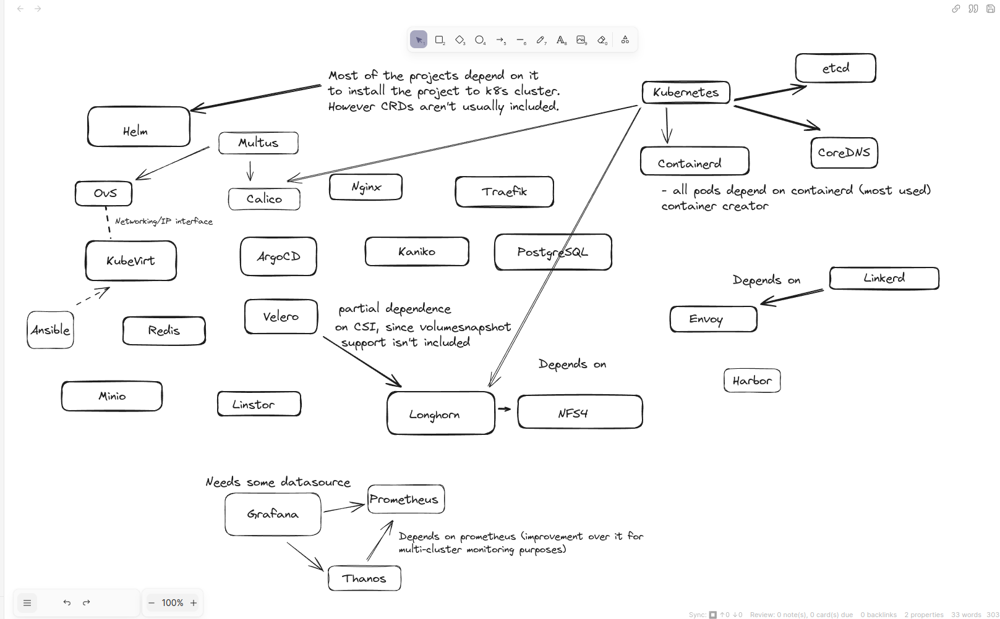

# Hello Kubernetes

## Exercise 3.06: DBaaS vs DIY

Do it yourself solution is when we require a specific database platform tailored for our specific needs. It is suitable when you have your own physical server, which gives you more control over database design and configurations. However with this freedom comes with additional complexity, since this database would have to be maintained and updated time to time. As services grow more databases are required therefore you would have to buy more physical servers, increase staffing for maintenance, handle electricity bills and replacing old components every 5 years. Buying multiple additional physical servers for failover cases and backing-up data. Developing/setting up a working monitoring and backup solution. Nonetheless, This still doesn't guarantee that your data is safe, since it is most likely for a small-sized company in one place. For example fire could take place and burn it all to ground, your data would be lost forever. All of this requires considerable time investment, which increases costs. Not to help organizational overhead, when you have to ask for permissions and approvals for usage of database. 
Nevertheless, you will also have to manage security of the data.
Database as a Service is much simpler solution in most cases, you own a database without paying to design and manage the software that runs on it. It will also be secured, out-sourcing the security is always good practice, because in most-cases vendor will take responsibility for the lost data. For example when microsoft update cost million of dollars to CrowdStrike company that handles security of microsoft softwares without affecting as much Microsoft itself. 
DBaaS solutions are usually ready to use, you initiate required solution by starting it with requirements that you want. Providers that are specialized in DBaaS invest a lot of resources in developing their security, backup and other services required for databases. Therefore there is in most cases guarantee of better database solutions than you could ever develop yourself.

## Exercise 5.08

1. With k3d I used of course Flannel
2. I have used Prometheus and Grafana in multiple purposes. I have created a system at work using thanos and other tools for monitoring multi-cluster solution
Including monitoring GPUs
3. I have used Nginx as a proxy for forwarding requests to differing api endpoints.
4. We use calico to serve IPs to pods
5. OpenVswitch for creating virtual switches for virtualmachines
6. Kubevirt to create virtualmachines inside a cluster.
7. Ansible to configure virtualmachines over a net
8. Minio for storing various backups including velero backups.
9. Velero for backing up deployments
10. Longhorn as our storage solution
11. Containerd for container management, namespace, process creation etc.
12. CoreDNS to handle k8s pods name to IP addr. translation
13. etcd to handle state of the cluster
14. Linkerd in this course to do canary release, which depends on envoy.
15. Harbor as a registry for storing images in our cluster.
16. Traefik for handling load balancing and ingress
17. Multus for combining multiple CNI together (In our case pod network and ovs)
18. Redis for ML project (Using RAM as storage)
19. Linstor as another storage solution of our nodes. Great for diskless nodes
20. Kaniko in our CI/CD pipeline to build and push image to Harbor
21. ArgoCD to do automatic pulls from repository to cluster in GitOps manner. 
There is much more that I might have forgotten to include.